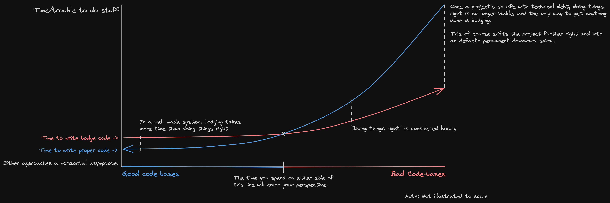

Some people view spending time on solving a problems 'the right way' anathema to fast delivery. This is my rough attempt to workshop why.

"Bodge" means the following:
> Bodging is a wonderful British word that means to patch together, to make temporary repairs. A bodge is clumsy, it's inelegant, it'll fall apart, but it'll work. And it'll keep working as long as there's someone around to bodge it again if it breaks.

\- [The Art of the Bodge](https://www.youtube.com/watch?v=lIFE7h3m40U) by Tom Scott
